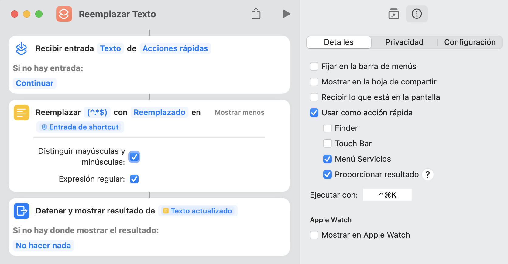

Holy crap, Shortcuts is a lot more powerful than I thought.

You can have it perform arbitrary regex replacement on any selected text via keyboard shortcut. Formula:

- Allow the Shortcut to be used as a Quick Action via keyboard shortcut, and have it receive Text input
- Add a "Replace Text" action, and toggle the "Regular Expression" option
- Add a "Stop and output" action, and have it receive the "Updated Text" variable from the "Replace Text" action before it
- Profit
- Example screenshot: 